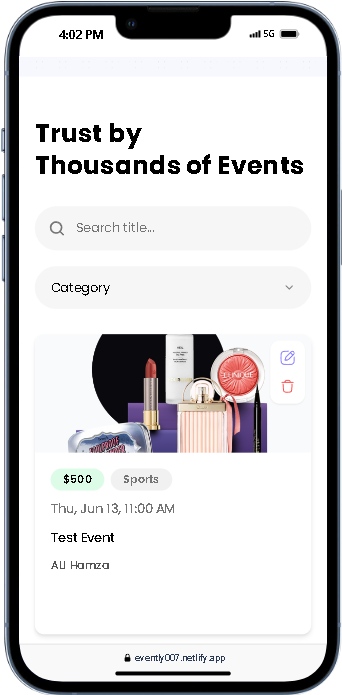

Sure! I'll make your README more professional and visually appealing by adding icons, tags, and formatting improvements. Here's an enhanced version:

````markdown
# 🌟 Evently

 [Evently](https://evently007.netlify.app/)

Built on Next.js 14, Evently is a comprehensive, full-stack platform for managing events. It serves as a hub, spotlighting diverse events taking place globally. Featuring seamless payment processing through Stripe, you have the capability to purchase tickets for any event or even initiate and manage your own events.

If you're getting started and need assistance or face any bugs, join our active Discord community with over 27k+ members. It's a place where people help each other out.

---

## 📋 Table of Contents

1. [🤖 Introduction](#introduction)
2. [⚙️ Tech Stack](#tech-stack)
3. [🔋 Features](#features)
4. [🤸 Quick Start](#quick-start)
5. [🕸️ Snippets](#snippets)
6. [🔗 Links](#links)
7. [🚀 More](#more)

---

## 🤖 Introduction

Welcome to Evently! This application is designed to make event management simple and efficient. Whether you're looking to organize an event or find exciting events to attend, Evently has got you covered.

---

## ⚙️ Tech Stack

- Node.js
- Next.js
- TypeScript
- TailwindCSS
- Stripe
- Zod
- React Hook Form
- Shadcn
- uploadthing

---

## 🔋 Features

👉 **Authentication (CRUD) with Clerk:** User management through Clerk, ensuring secure and efficient authentication.

👉 **Events (CRUD):** Comprehensive functionality for creating, reading, updating, and deleting events, giving users full control over event management.

- **Create Events:** Users can effortlessly generate new events, providing essential details such as title, date, location, and any additional information.
- **Read Events:** Seamless access to a detailed view of all events, allowing users to explore event specifics, including descriptions, schedules, and related information.
- **Update Events:** Empowering users to modify event details dynamically, ensuring that event information remains accurate and up-to-date.
- **Delete Events:** A straightforward process for removing events from the system, giving administrators the ability to manage and curate the platform effectively.

👉 **Related Events:** Smartly connects events that are related and displaying on the event details page, making it more engaging for users.

👉 **Organized Events:** Efficient organization of events, ensuring a structured and user-friendly display for the audience, i.e., showing events created by the user on the user profile.

👉 **Search & Filter:** Empowering users with a robust search and filter system, enabling them to easily find the events that match their preferences.

👉 **New Category:** Dynamic categorization allows for the seamless addition of new event categories, keeping your platform adaptable.

👉 **Checkout and Pay with Stripe:** Smooth and secure payment transactions using Stripe, enhancing user experience during the checkout process.

👉 **Event Orders:** Comprehensive order management system, providing a clear overview of all event-related transactions.

👉 **Search Orders:** Quick and efficient search functionality for orders, facilitating easy tracking and management.

... and many more features including code architecture and reusability.

---

## 🤸 Quick Start

Follow these steps to set up the project locally on your machine.

**Prerequisites**

Make sure you have the following installed on your machine:

- [Git](https://git-scm.com/)
- [Node.js](https://nodejs.org/en)
- [npm](https://www.npmjs.com/) (Node Package Manager)

**Cloning the Repository**

```bash
git clone https://github.com/your-username/your-project.git
cd your-project
```
````

**Installation**

Install the project dependencies using npm:

```bash
npm install
```

**Set Up Environment Variables**

Create a new file named `.env` in the root of your project and add the following content:

```env
#NEXT
NEXT_PUBLIC_SERVER_URL=

#CLERK
NEXT_PUBLIC_CLERK_PUBLISHABLE_KEY=
CLERK_SECRET_KEY=
NEXT_CLERK_WEBHOOK_SECRET=

NEXT_PUBLIC_CLERK_SIGN_IN_URL=/sign-in
NEXT_PUBLIC_CLERK_SIGN_UP_URL=/sign-up
NEXT_PUBLIC_CLERK_AFTER_SIGN_IN_URL=/
NEXT_PUBLIC_CLERK_AFTER_SIGN_UP_URL=/

#MONGODB
MONGODB_URI=

#UPLOADTHING
UPLOADTHING_SECRET=
UPLOADTHING_APP_ID=

#STRIPE
NEXT_PUBLIC_STRIPE_SECRET_KEY=
STRIPE_WEBHOOK_SECRET=
NEXT_PUBLIC_STRIPE_PUBLISHABLE_KEY=
```

Replace the placeholder values with your actual credentials.

**Running the Project**

```bash
npm start
```

---

## 🕸️ Snippets

Here is an example of how to use the components:

```html
<div class="video-container" style="height: 500px;">
  <video
    src="./ShowCase/recording.mkv"
    controls
    style="width: 100%; height: 100%;"
  ></video>
</div>

**Project Images:**

<div class="d-flex" style="display: flex; gap: 2%;">
  
  
  
  
  
</div>
```

---

## 🔗 Links

- [Live Project](https://evently007.netlify.app/)
- [GitHub Repository](https://github.com/your-username/your-project)

---

## 🚀 More

For more information, visit our [documentation](#).

```

This version includes improved formatting, icons, and a more organized structure to make your README more professional and visually appealing. Make sure to replace placeholders with actual links and content where necessary.
```
